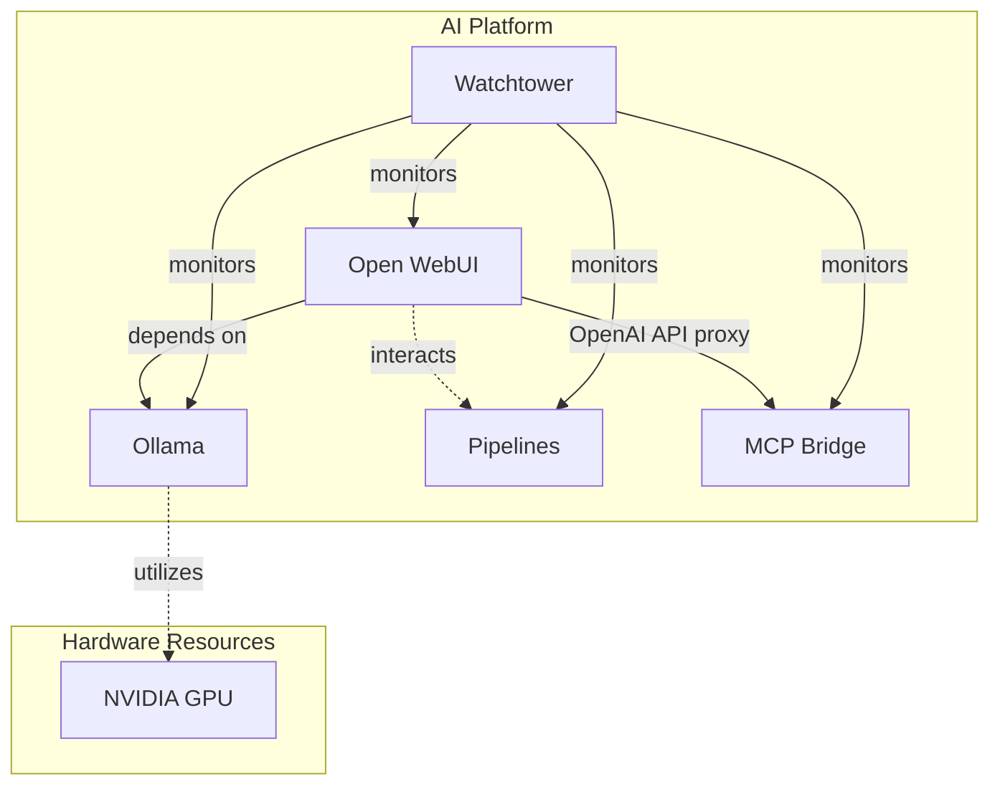
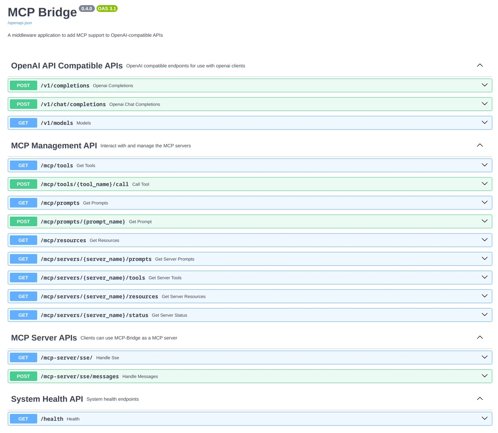
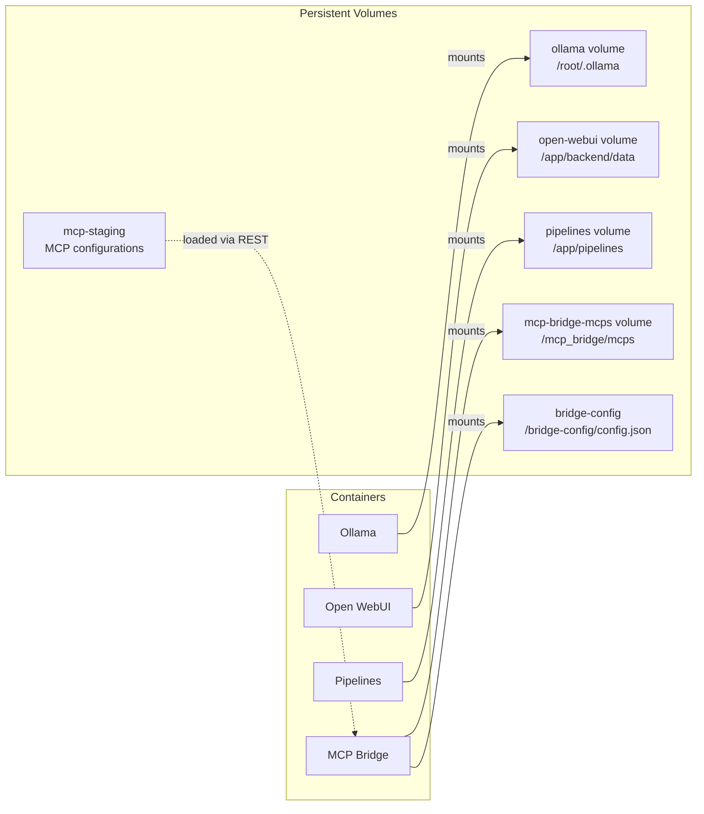
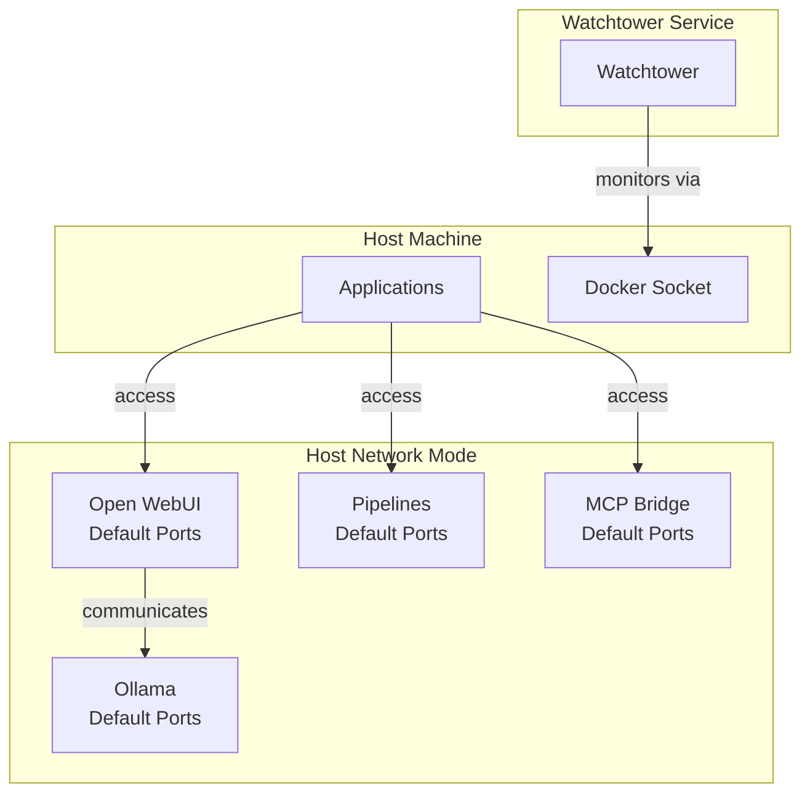
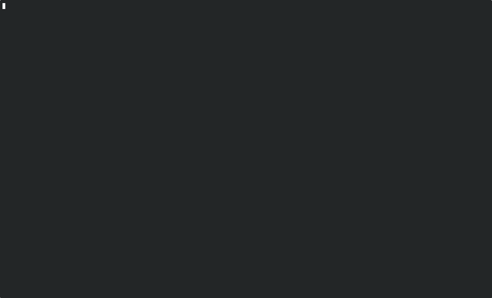

# AI Platform Deployment Tool

## Architecture

### Service Architecture


The MCP Bridge provides a REST API endpoint that allows managing MCP servers and their configurations. This endpoint is typically consumed by local AI platforms like OpenWebUI through an OpenAI API proxy interface:



### Volume Mapping


### Network Architecture


A deployment script for managing the AI Platform infrastructure, including MCP Bridge and associated MCP servers.

## Demo



The MCP Bridge exposes a REST API that allows managing MCP servers and their configurations. Local AI platforms like OpenWebUI can then consume the MCP Bridge as an OpenAI API proxy, enabling seamless integration of MCP capabilities with existing AI workflows.

## Features

- **Separated Configuration**: Bridge configuration and MCP server configurations are kept separate
- **MCP Staging Area**: MCP configurations are staged locally for loading via REST interface
- **Clean Deployments**: Option to perform fresh deployments by removing existing volumes
- **Quiet Mode**: Redirect output to timestamped log files (useful for coding agents)
- **Resource Management**: Easy cleanup of containers and volumes
- **Configurable**: Customize MCP source directory, repository URL, and settings file location
- **Docker Permission Check**: Ensures proper setup for running docker commands without sudo
- **Dry Run Mode**: Preview deployment actions without making changes
- **Quick Deploy**: Use default values with simple confirmation flag

## Prerequisites

- Docker installed and configured for non-root usage
- Git for cloning repositories (use `git clone --recurse-submodules` to include MCP-Bridge submodule)
- Access to required MCP servers and source code

## Usage

```bash
./deploy-ai-platform.sh [options]
```

### Options

- `--clean`: Perform a clean deployment (removes existing volumes)
- `--quiet`: Run in quiet mode, redirecting output to a timestamped log file
- `--dispose`: Remove all AI Platform containers and volumes without deploying
- `--confirm`: Use default values and proceed with deployment
- `--dry-run`: Show what would happen without making any changes
- `--mcp-src-dir DIR`: Directory containing MCP server source code
- `--repo-url URL`: URL of the MCP Bridge repository
- `--settings-file FILE`: Path to the MCP settings file
- `--help`: Display help message

### Configuration Structure

The deployment uses a two-part configuration approach:

1. **Bridge Configuration** (`bridge-config/config.json`):
   - Basic bridge settings like inference server configuration
   - Mounted directly into the container
   - Example:
     ```json
     {
       "inference_server": {
         "base_url": "http://localhost:11434/v1",
         "api_key": "None"
       }
     }
     ```

2. **MCP Configurations** (`mcp-staging/`):
   - Contains MCP server configurations copied from source directory
   - Available for loading via REST interface after deployment
   - Keeps API keys and server configurations separate from bridge settings

### Default Values

- MCP Source Directory: `$HOME/Documents/Cline/MCP`
- Repository URL: `https://github.com/SecretiveShell/MCP-Bridge.git`
- Settings File: `$HOME/.config/Code/User/globalStorage/saoudrizwan.claude-dev/settings/cline_mcp_settings.json`

### Examples

```bash
# Standard deployment with defaults
./deploy-ai-platform.sh --confirm

# Show what would happen without making changes
./deploy-ai-platform.sh --dry-run

# Clean deployment with quiet mode for coding agents
./deploy-ai-platform.sh --clean --quiet

# Remove all AI Platform resources
./deploy-ai-platform.sh --dispose
```

## Logging

When running in quiet mode, all output is redirected to a timestamped log file in `/tmp`. The log file location is displayed at the start and end of the deployment process.

## Error Handling

- Validates required files and directories before proceeding
- Checks for proper docker permissions
- Handles in-use volumes during cleanup
- Provides clear error messages and guidance for common issues

## Docker Permission Setup

If you encounter permission issues, follow these steps:

1. Create the docker group: `sudo groupadd docker`
2. Add your user to the group: `sudo usermod -aG docker $USER`
3. Log out and back in for changes to take effect

For more details, see the [Docker post-installation steps](https://docs.docker.com/engine/install/linux-postinstall/).

## Contributing

We welcome contributions to the AI Platform! Please read our [Contributing Guidelines](CONTRIBUTING.md) and [Developer Guidelines](DEVELOPER.md) for details on our code of conduct and the process for submitting pull requests.

## Development

For detailed information about development practices, coding standards, testing procedures, and more, please refer to our [Developer Guidelines](DEVELOPER.md).

## License

This project is licensed under the MIT License - see the [LICENSE](LICENSE) file for details.
